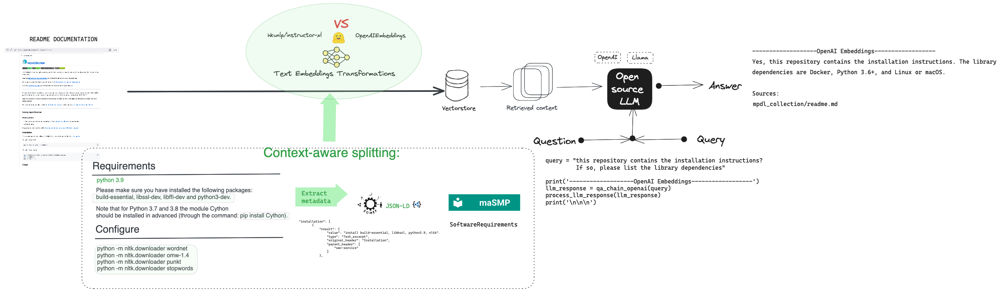

# RAG over SMP

This repository contains few eperiments around Retrieval-augmented generation (RAF) and Machine-actionable Software Management Plans (SMP) for the [NFDI4DS Mini Hackathons](https://www.nfdi4datascience.de/community/events/minihackathons/) at ZB Med in Cologne.

## Use case
---
Q&A over the code base to understand how it works



## Overview
---
This program aims: 1. Gets README's from github and send it to a text emmbeddings model employing splitting strategy. 2. Gets the model result ("Installation" or "Not Installation") from an API. 3. If the classification result is "Installation", it will extract metadata from the README using [SOMEF](). 4. [Maybe] Sends the metadata in JSON-LD format to open-source LLM's model and do Q&A


## Installation

You might want to create and activate local environment before installing the module:

```bash
python -m venv .venv
source .venv/bin/activate
```

Install the module:

```bash
pip install -r requirements.txt
```

## Use Cases
Here you find executable notebook in Jupyter:
-  https://mybinder.org/dummy-notebook
- 

## Acknowledges
---
The activity was carried out during the maSMP hackathon at [ZB MED](https://www.zbmed.de/en/) sponsored by [NFDI4DataScience](https://www.nfdi4datascience.de/). NFDI4DataScience is a consortium funded by the German Research Foundation (DFG), project number 460234259.

## ☑️ TODO

- [ ] Get bioinformatics GitHub repositories via SH API
- [ ] Fetch README's in the pipeline
- [ ] Use other open source LLMs e.g. [LlaMA](https://about.fb.com/news/2023/08/code-llama-ai-for-coding/) via [Ollama integration](https://ollama.ai/blog/run-code-llama-locally)
- [ ] Re-train the model on more data from UniProt?

